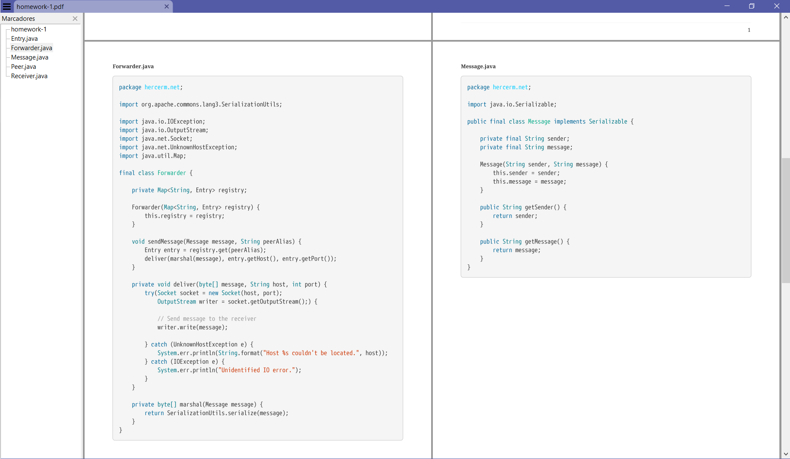

# pric - print code to PDF

I once had a college course where we were required to deliver our code in PDF format. It was a pain to copy/paste it manually to produce the document, and even attempting to use LaTeX required some setup. This tool seeks to help anyone in a similar situation.

## An example is worth a thousand words

Take this directory structure. Lets say I want to put the Java files under `src/main` in a PDF.

```
$ pwd
/c/Users/hjcer/Documents/temp/Forrec

$ tree src
src
|-- main
|   |-- java
|   |   `-- hercerm
|   |       `-- net
|   |           |-- Entry.java
|   |           |-- Forwarder.java
|   |           |-- Message.java
|   |           |-- Peer.java
|   |           `-- Receiver.java
|   `-- resources
|       `-- META-INF
|           `-- MANIFEST.MF
`-- test
    `-- java
        |-- Client.java
        |-- Playground.java
        `-- Server.java

8 directories, 9 files
```

To generate the PDF run the following:

```bash
 pric homework-1.pdf -e java -p src/main -ra 'Hernán Cervera' -t 'Forrec: A mini-framework'
```

Which produces `homework-1.pdf`, with a cover page, ToC (table of contents) shown by the PDF reader and syntax highlighted code listings.

<p align="center">
    
</p>

## Options, parameters and exit codes

Worthy to mention:

- If you would like to further customize the PDF, for example by adding a paragraph or some other information, you can use `--keep-asciidoc` to preserve the AsciiDoc file and manually edit it as you will. Then it is simple to generate your PDF by using [`asciidoctor-pdf`](https://github.com/asciidoctor/asciidoctor-pdf#install-the-published-gem).
- By default, the PDF generated has one file per page. If you are dealing with many small files, this might not be ideal. The `--compact` option generates a PDF with no cover page, no ToC (unfortunately), and attempts to place more files per page.

```
$ pric -h

Print multiple source code files to a single PDF file.

pric <file> (-e <ext>[,<ext>...] | -f <regex>[:<regex>...]) [OPTIONS]

Parameters:
      file                Filename of the PDF, must end in '.pdf'.

Options:
  -a, --author=<author>   Author of the document.
  -c, --compact           Produce a PDF with less pages.
  -e, --extensions=<ext>[,<ext>...]
                          Extensions of the files to be printed.
  -f, --files=<regex>[:<regex>...]
                          Match filenames by regex.
  -h, --help              Show this help message and exit.
  -k, --keep-asciidoc     Preserve AsciiDoc file after PDF generation.
  -p, --paths=<path>[?<path>...]
                          Absolute or relative paths to directories to search
                            for files (default is current directory)
  -r, --recursive         Recurse sub-directories.
  -s, --silent            Do not show log messages.
  -t, --title=<title>     Title of the document. If omitted, filename is used.
  -V, --version           Print version information and exit.

Exit codes:
  0    Successful PDF generation.
  1    No PDF was generated.

Examples:
Print to out.pdf all Java and XML files on the current dir and its sub-dirs.
pric out.pdf -re java,xml

Print to out.pdf all Markdown files and the LICENSE file found on the current
directory.
pric out.pdf -f 'LICENSE:.*[.]md'
```

## Requirements

- Groovy 3
- Java 8

## Installation

### Linux

Download [pric](pric) and provide execution permission:

```
chmod +x pric
```

To have the script globally available, copy it to `/usr/local/bin`.

### Windows

1. Make sure you have a shell that supports Bash, e.g. [Git Bash](https://gitforwindows.org/).
2. Download [pric](pric) to your machine and you are done.
3. (Optional but recommended) Make the script globally available by configuring your `PATH` environment variable.

## Known issues

Please note that this is not a finished project and certainly has bugs. The issues I have been able to find are mostly related to incorrectly displaying file contents in the PDF.

Some issues I found:

- `WARNING: An illegal...` is always thrown by a dependency, however this doesn't have an impact on the output.
- Files that have a line containing **only** the characters `----`  produce unwanted code listings in the PDF.
- Files which absolute path contain `[]` can't be found.
